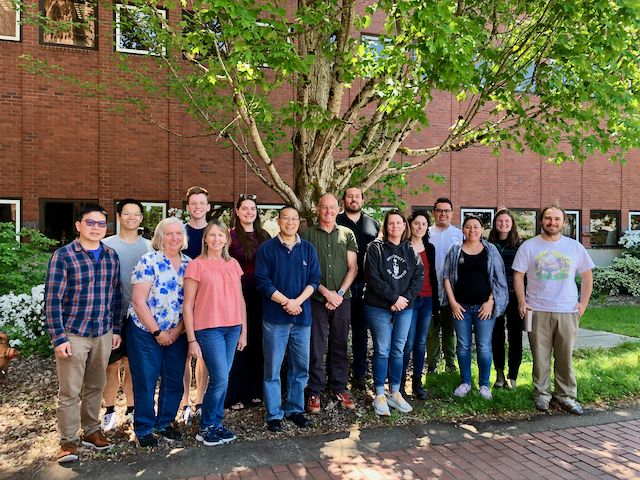

# Several joint postdoctoral scholar positions are available in the Jeff Chang, Jessie Uehling and Nik Grunwald labs at Oregon State University

Candidates interested please download the announcements here:

[Chang/Grunwald postdoc  positions: Molecular plant-microbe interactions I and II](PD_position_Chang_Grunwald.pdf)

[Uehling/Grunwald postdoc  position: Population and phylogenomics of fungi and oomycetes](PDs_ad_Uehling-Grunwald-2023.pdf)

